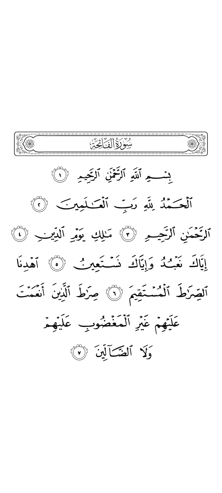
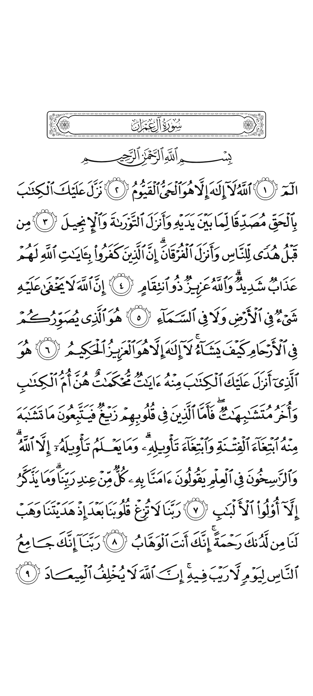
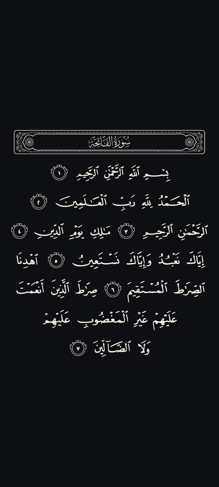
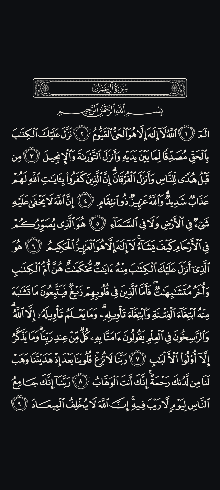

# Madani 1405 · Mushaf render package

The Madani Mushaf of 1405 AH (the classic Madinah print, 604 pages, 15 lines) as a small, self-contained **render package**: one HTML page plus the 604 original QCF page fonts. It draws every page as crisp vector text, in the exact layout of the printed Mushaf, on any screen, in a light or a dark theme. It is the "Madani 1405" page style of the Sakina / al-Quran app.

Мадинский мусҳаф 1405 г. х. (классическое мадинское издание, 604 страницы, 15 строк) в виде небольшого самостоятельного **пакета рендера**: одна HTML-страница и 604 оригинальных шрифта QCF, по одному на страницу. Он рисует каждую страницу чётким векторным текстом, точно по разметке печатного мусҳафа, на любом экране, в светлой или тёмной теме. Это стиль страниц «Madani 1405» в приложении Sakina / al-Quran.

| Light · Светлая | | Dark · Тёмная | |
| :---: | :---: | :---: | :---: |
|  |  |  |  |
| page 1 | page 50 | page 1 | page 50 |

<p align="center">
  <a href="https://github.com/SakinaDevGroup/al_quran_madani/releases/download/v1.0/madani_package.zip"><b>⬇ Download madani_package.zip</b></a> · 46 MB · <a href="../../releases/tag/v1.0">Release v1.0</a>
</p>

**Languages:** [English](#english) · [Русский](#русский)

---

## English

### Download

```
https://github.com/SakinaDevGroup/al_quran_madani/releases/download/v1.0/madani_package.zip
```

| | |
| --- | --- |
| File | `madani_package.zip` — 48 313 358 bytes (46 MB) |
| SHA-256 | `5f2241819796d17025b1b5d8d2ac2bcccd7151c518b1e263c8cfdaa471450e88` |
| Pages | 604 (Madani 1405 print, Hafs 'an 'Asim) |

Check the hash after downloading — an app should refuse a package that does not match.

### What is inside the package

```
index.html                 the renderer (HTML + CSS + JS, no dependencies)
quran_pages.json           the layout: every line of every page, glyph by glyph
fonts/QCF_P001.woff2 …     604 page fonts, one per page (QCF, Madani 1405)
fonts/QCF_P604.woff2
fonts/surah-header.woff2   the ornamental surah band (colour font)
fonts/bismillah.woff2      the basmala (colour font)
```

This repository also holds:

```
pages_info.json            first and last ayah of every page — [{ "f": "1:1", "l": "1:7" }, …]
previews/                  the images above
```

`pages_info.json` is kept outside the package on purpose: it is 15 KB, and an app needs it to open the right page (bookmarks, "go to surah", recitation following) before the 46 MB package has been downloaded.

### How to use it

Unzip the package into a folder and open `index.html` in a WebView (or any browser), then feed it the layout:

```js
// quran_pages.json → the renderer. Accepts the JSON text or the parsed array.
initializeData(pagesJson);

loadPage(50);             // show page 1…604
setDark(true);            // night theme: #0D0F12 page, light ink
setAccent('#1f5e56');     // colour of the ayah highlight
highlightAyah(3, 7);      // highlight Al-Imran 3:7 on the current page
clearHighlight();
```

A Flutter example (`flutter_inappwebview`):

```dart
final dir = '${(await getApplicationDocumentsDirectory()).path}/mushaf_madani_1405';
// …download madani_package.zip, verify SHA-256, extract into `dir`…

InAppWebView(
  initialUrlRequest: URLRequest(url: WebUri('file://$dir/index.html')),
  initialSettings: InAppWebViewSettings(allowFileAccessFromFileURLs: true),
  onLoadStop: (controller, _) async {
    final pages = await File('$dir/quran_pages.json').readAsString();
    await controller.evaluateJavascript(source: 'initializeData(${jsonEncode(pages)})');
    await controller.evaluateJavascript(source: 'loadPage(1)');
  },
);
```

Every word is a `<span class="word">` carrying `data-surah`, `data-ayah` and `data-page`, so taps can be resolved to an ayah for recitation, bookmarks or notes.

### The layout format (`quran_pages.json`)

An array of 604 pages; each page is `{ "l": [ …lines ] }`, and each line is one of:

| `t` | Line | Fields |
| --- | --- | --- |
| `s` | Surah header | `s` surah number, `n` header glyph |
| `b` | Basmala | `g` glyphs, `w` `h` `c` ornament metrics (em) |
| `a` | Ayah line | `g` word glyphs, `r` runs `[surah, ayah, wordCount]`, `c` 1 = centred line |

The page keeps a fixed line pitch, the way a press leads its lines: the two short opening pages are led like a full one and sit centred on the sheet, and on a short (landscape) screen the text keeps its reading size and scrolls instead of shrinking.

### Sources and credits

- **Page fonts and layout:** the QCF (Qur'an Complex Font) set for the Madani 1405 Mushaf by the *King Fahd Glorious Qur'an Printing Complex* (Madinah), as published through the [Quranic Universal Library (QUL)](https://qul.tarteel.ai/) — used under their terms of use.
- **Surah header and basmala:** the colour fonts shared with [KFGQPC_V4_tajweed](https://github.com/SakinaDevGroup/KFGQPC_V4_tajweed), recoloured to plain ink to match the engraved 1405 print.
- **Renderer:** SakinaDevGroup, for the Sakina / al-Quran app.

The Qur'anic text is not modified. If you find an error on any page, please [open an issue](../../issues) with the page number.

### Related

- [mushaf-madani-cdn](https://github.com/SakinaDevGroup/mushaf-madani-cdn) — the KFGQPC V4 Mushaf as ready PNG pages, without tajweed colours.
- [mushaf-tajweed-cdn](https://github.com/SakinaDevGroup/mushaf-tajweed-cdn) — the same as PNG pages with tajweed colours.
- [KFGQPC_V4_tajweed](https://github.com/SakinaDevGroup/KFGQPC_V4_tajweed) — the KFGQPC V4 render package (colour fonts, tajweed).

---

## Русский

### Скачать

```
https://github.com/SakinaDevGroup/al_quran_madani/releases/download/v1.0/madani_package.zip
```

| | |
| --- | --- |
| Файл | `madani_package.zip` — 48 313 358 байт (46 МБ) |
| SHA-256 | `5f2241819796d17025b1b5d8d2ac2bcccd7151c518b1e263c8cfdaa471450e88` |
| Страниц | 604 (мадинское издание 1405, риваят Хафс от Асыма) |

После скачивания проверяйте хеш — приложение не должно принимать пакет, который с ним не совпадает.

### Что внутри пакета

```
index.html                 рендер (HTML + CSS + JS, без зависимостей)
quran_pages.json           разметка: каждая строка каждой страницы, глиф за глифом
fonts/QCF_P001.woff2 …     604 шрифта страниц, по одному на страницу (QCF, Madani 1405)
fonts/QCF_P604.woff2
fonts/surah-header.woff2   орнаментальная рамка заголовка суры (цветной шрифт)
fonts/bismillah.woff2      басмала (цветной шрифт)
```

Кроме того, в этом репозитории лежат:

```
pages_info.json            первый и последний аят каждой страницы — [{ "f": "1:1", "l": "1:7" }, …]
previews/                  картинки выше
```

`pages_info.json` лежит вне пакета намеренно: он весит 15 КБ, и приложению он нужен, чтобы открыть нужную страницу (закладки, «перейти к суре», следование за чтецом) ещё до того, как скачан пакет на 46 МБ.

### Как использовать

Распакуйте пакет в папку, откройте `index.html` в WebView (или в любом браузере) и передайте ему разметку:

```js
// quran_pages.json → рендер. Принимает текст JSON или уже разобранный массив.
initializeData(pagesJson);

loadPage(50);             // показать страницу 1…604
setDark(true);            // ночная тема: страница #0D0F12, светлые буквы
setAccent('#1f5e56');     // цвет подсветки аята
highlightAyah(3, 7);      // подсветить Оли Имрон 3:7 на текущей странице
clearHighlight();
```

Пример для Flutter (`flutter_inappwebview`):

```dart
final dir = '${(await getApplicationDocumentsDirectory()).path}/mushaf_madani_1405';
// …скачать madani_package.zip, проверить SHA-256, распаковать в `dir`…

InAppWebView(
  initialUrlRequest: URLRequest(url: WebUri('file://$dir/index.html')),
  initialSettings: InAppWebViewSettings(allowFileAccessFromFileURLs: true),
  onLoadStop: (controller, _) async {
    final pages = await File('$dir/quran_pages.json').readAsString();
    await controller.evaluateJavascript(source: 'initializeData(${jsonEncode(pages)})');
    await controller.evaluateJavascript(source: 'loadPage(1)');
  },
);
```

Каждое слово — это `<span class="word">` с атрибутами `data-surah`, `data-ayah` и `data-page`, поэтому нажатие легко привязать к аяту: для чтения, закладок или заметок.

### Формат разметки (`quran_pages.json`)

Массив из 604 страниц; каждая страница — `{ "l": [ …строки ] }`, каждая строка — одна из:

| `t` | Строка | Поля |
| --- | --- | --- |
| `s` | Заголовок суры | `s` номер суры, `n` глиф заголовка |
| `b` | Басмала | `g` глифы, `w` `h` `c` размеры орнамента (em) |
| `a` | Строка аятов | `g` глифы слов, `r` отрезки `[сура, аят, число слов]`, `c` 1 = строка по центру |

Страница держит постоянный шаг строк, как в типографии: две короткие первые страницы набраны с тем же интервалом, что и полные, и стоят по центру листа, а на низком (альбомном) экране текст сохраняет размер для чтения и прокручивается, а не сжимается.

### Источники и благодарности

- **Шрифты страниц и разметка:** набор QCF (Qur'an Complex Font) для мадинского мусҳафа 1405 г. *Комплекса короля Фахда по изданию Священного Корана* (Медина), опубликованный через [Quranic Universal Library (QUL)](https://qul.tarteel.ai/), — используется на их условиях.
- **Заголовок суры и басмала:** цветные шрифты из [KFGQPC_V4_tajweed](https://github.com/SakinaDevGroup/KFGQPC_V4_tajweed), перекрашенные в один цвет под гравированное издание 1405 г.
- **Рендер:** SakinaDevGroup, для приложения Sakina / al-Quran.

Текст Корана не изменён. Если нашли ошибку на какой-либо странице, [создайте issue](../../issues) с номером страницы.

### Связанные репозитории

- [mushaf-madani-cdn](https://github.com/SakinaDevGroup/mushaf-madani-cdn) — мусҳаф KFGQPC V4 готовыми PNG-страницами, без цветов таҷвида.
- [mushaf-tajweed-cdn](https://github.com/SakinaDevGroup/mushaf-tajweed-cdn) — то же самое PNG-страницами с цветами таҷвида.
- [KFGQPC_V4_tajweed](https://github.com/SakinaDevGroup/KFGQPC_V4_tajweed) — пакет рендера KFGQPC V4 (цветные шрифты, таҷвид).
